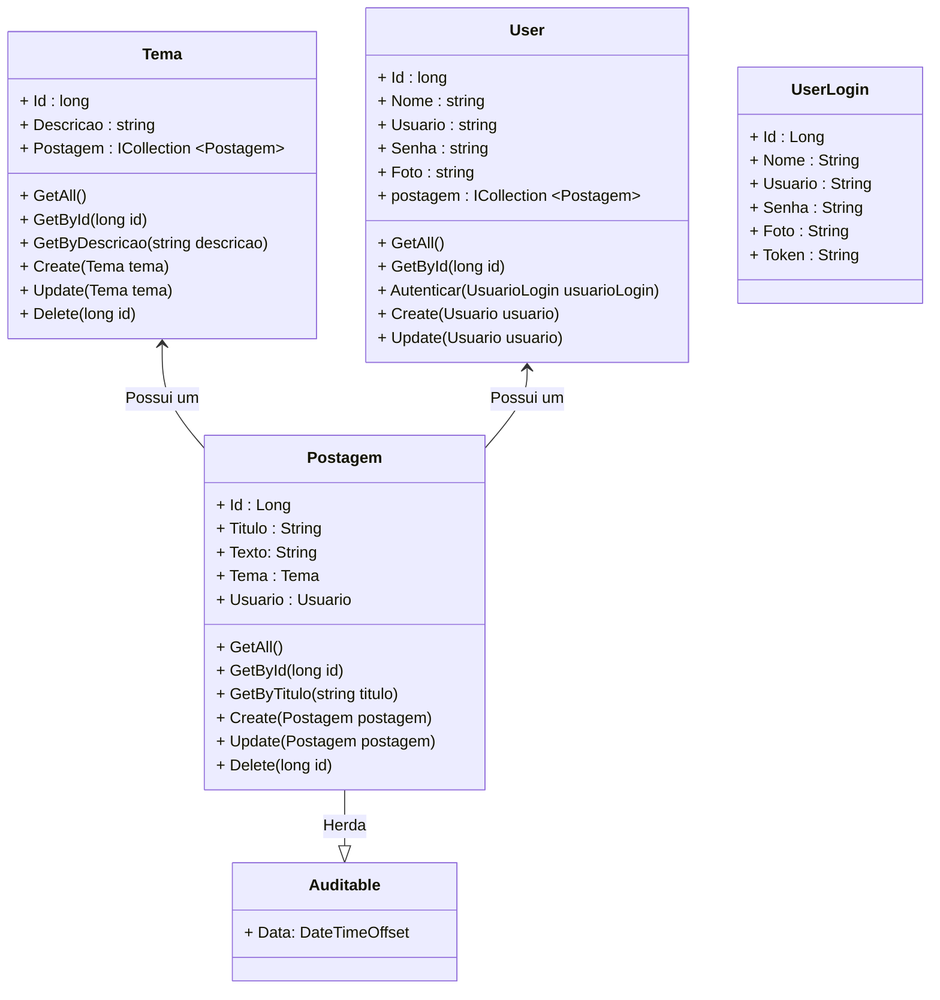

# Projeto Blog Pessoal

Projeto Blog Pessoal desenvolvido em ASP.NET - Core 7

 

     

  

## Diagrama de Classes

```mermaid
classDiagram
class Tema {
  + Id : long
  + Descricao : string
  + Postagem : ICollection ~Postagem~
  + GetAll()
  + GetById(long id)
  + GetByDescricao(string descricao)
  + Create(Tema tema)
  + Update(Tema tema)
  + Delete(long id)
}
class Postagem {
  + Id : Long
  + Titulo : String
  + Texto: String
  + Tema : Tema
  + Usuario : Usuario
  + GetAll()
  + GetById(long id)
  + GetByTitulo(string titulo)
  + Create(Postagem postagem)
  + Update(Postagem postagem)
  + Delete(long id)
}
class Auditable {
  + Data: DateTimeOffset
}
class User {
  + Id : long
  + Nome : string
  + Usuario : string
  + Senha : string
  + Foto : string
  + postagem : ICollection ~Postagem~
  + GetAll()
  + GetById(long id)
  + Autenticar(UsuarioLogin usuarioLogin)
  + Create(Usuario usuario)
  + Update(Usuario usuario)
}
class UserLogin{
  + Id : Long
  + Nome : String
  + Usuario : String
  + Senha : String
  + Foto : String
  + Token : String
}
Postagem --|> Auditable: Herda
Tema <-- Postagem: Possui um
User <-- Postagem: Possui um
```
